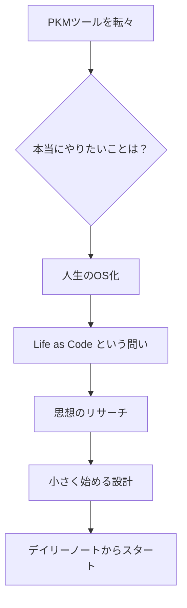

> **シリーズ:** Life as Code [2/連載中] — 前: [人生をGitHubで「デプロイ」する：Life as Codeの実験開始](https://tomo-yamada-doublemoon.github.io/til/posts/life-as-code-experiment/) / 次: [賢いモデルには、細かく指示しないほうがいい](https://tomo-yamada-doublemoon.github.io/til/posts/dont-over-instruct-smart-models/)

## この記事でわかること

- PKMツールが「回らない」理由を別の角度から捉え直す視点
- 「Life as Code」が単なるタスク管理と何が違うのか
- 完璧主義の罠を回避して、小さく始めることを選んだ判断プロセス

## こんな人向け

NotionやObsidianを試したけどどれも中途半端で終わってしまった方、「GitHubで人生管理」に興味があるけど難しそうで踏み出せていない方。

## 前提

- 使ったツール: GitHub、Claude（壁打ち）
- 課題フェーズ: ADS外・個人プロジェクト
- 前提知識: 前編（Life as Codeの実験開始）を読んでいると文脈がつながりやすいです

---

## PKMを転々としてきた、という前史

Notion、Obsidian、Roam、その他もろもろ。

「第二の脳」系のツールや理論はひとしきり触れてきました。でもどれも中途半端に終わりました。ツールが悪いというより、自分の中に「何のためにやっているか」が定まっていなかったように思います。

## ADSでGitHubを使い始めて、問いが立った

AI-Driven Schoolの課題を進める中で、GitHubを日常的に使うようになりました。リポジトリを作り、コミットし、ブランチを切る。そのうちに、ふと思いました。

**「あれ、これって人生の管理にも使えるんじゃないか？」**

そのまま調べていたら、エンジニアの方が書いたZennの記事にたどり着きました。`life` というリポジトリを作り、日々の課題をIssueで管理し、日記をコミットしているという実践記録です。

> [githubで人生を管理する — Kyohei Fukuda](https://zenn.dev/hand_dot/articles/85c9640b7dcc66)

「仕事でいつも使っているツールを、生活のタスク管理にも使う」という発想は、エンジニアにとって自然な選択のようです。自分はエンジニアではないですが、読んでいて「これだ」という感覚がありました。

## でも、「PKMがしたいわけじゃない」と気づいた

そこで一度立ち止まって、自分が本当にやりたいことを壁打ちしてみました。

すると出てきたのが、こういう問いでした。

**「自分がやりたいのは、PKM（個人の知識管理）なのか？」**

答えはNoでした。

ツールを使いこなしたいのではなく、**自分の人生をOS化したい**のだと気づきました。OSとは、あらゆる動作の土台になるシステムのこと。知識を整理するだけでなく、目標・習慣・記録・振り返りが一つの仕組みの上で動いている状態です。

PKMはその一機能に過ぎません。

## 思想を探していたら、「Life as OS」という概念に出会った

「Life as OS」で調べていると、GitHubにこんなリポジトリが見つかりました。

> [Personal AI Infrastructure — danielmiessler](https://github.com/danielmiessler/Personal_AI_Infrastructure)

星が14,000以上あるプロジェクトで、最新バージョンのサブタイトルはそのまま **"Life Operating System"** でした。

AIをエージェントとして動かしながら、目標・記憶・スキル・自己改善ループを一つの基盤に統合する設計思想です。エンジニア向けの本格的なシステムで、自分がそのまま使えるものではありませんが、**「人生をOSとして設計する」という考え方そのもの**に共鳴しました。

## 「ちゃんとやろうとしすぎ」を自覚した

思想が固まると、次は設計したくなりました。リポジトリの構造はどうするか、ブランチ戦略は、ラベルの設計は……。

これは自分のいつものクセです。

> ちゃんとやろうとしすぎて、始めるのが後になる。

そのクセに気づいたので、また壁打ちしました。出てきた答えはシンプルでした。

**「今すでにやっていることをGitHubに入れるところから始める」**

ADSの課題と並行して毎日続けているデイリーブリーフィングと夜の記録。Claudeのスキルを使って構造化された形で行っている、この日次ルーティンの内容を、まずデイリーノートとしてリポジトリに入れてみます。

設計より先に、動かすことを選びました。

## Life as Code、やっとスタート

前編の記事を書いたのは4月のこと。コンセプトだけ書いて、実装はゼロでした。

あれから約2ヶ月。思想を固め、リサーチし、壁打ちし、クセを自覚し、小さな一歩を選びました。

ようやくリポジトリができました。

まだデイリーノートを入れ始めたばかりで、「回っている」とは言えません。でもそれでいいと思っています。コードと同じで、最初のコミットがあれば、あとは育てていけます。

> デイリーノートをGitHubで運用してみた話は、また別の記事で書く予定です。

---

## 再現手順（3ステップ）

1. **「何がしたいか」を問い直す** — ツールを探す前に、PKMなのかOS化なのか、目的を壁打ちで言語化する
2. **思想の参照点を見つける** — 先人の実践（Zenn記事、GitHubリポジトリ等）で「これだ」という感覚を確認する
3. **今すでにやっていることから始める** — 新しい仕組みを作るより、既存の習慣をGitHubに乗せるところから動かす

## この記事で出た用語

| 用語 | 一行定義 |
|---|---|
| PKM | Personal Knowledge Management。個人の知識や情報を整理・管理する手法・ツール群の総称 |
| Life as OS | 人生全体をOSのように設計し、目標・習慣・記録・改善ループを一つの基盤で動かすという考え方 |
| デイリーノート | 毎日の行動・思考・記録をMarkdownで残したもの。今回はGitHubのリポジトリに格納する |

💡 **OHOポイント:** 「ちゃんとやろうとしすぎるクセ」を自覚して壁打ちした瞬間が、Life as Codeの最初のコミットだったのかもしれません。
