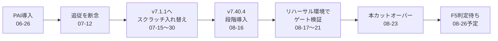

> **シリーズ:** LifeOS変遷記 [1/連載中]

## この記事でわかること

- 自分用AIシステム「LifeOS」を、PAI時代から今まで何度も移行してきた変遷
- 「作り直す」と「段階移行してからリハーサルする」、判断がどう変わっていったか
- 移行を重ねるたびに増えていった、次の移行のための工夫

## こんな人向け

- 自分専用のツール・システムを長く育てていて、大きな作り直しのタイミングに悩んでいる人
- 「アップデートに追従するか、作り直すか」の判断で迷ったことがある人

## 前提

- 使ったツール: Claude Code、LifeOS(自作のAI運用基盤)
- OS/環境: Mac
- 課題フェーズ: 該当なし(自分のAIシステムLifeOSの運用・移行の記録)

---

このMacで動いている自分用AIシステム「LifeOS」は、ここまでに何度か大きな移行を経験しています。今日、その最新の移行が一段落したので、時系列を振り返ってみました。

振り返って気づいたのは、移行の中身そのものより、**移行のやり方が回を重ねるたびに変わっていた**ということでした。

## 最初の一歩は、素のClaude Codeだった

出発点は今年4月末で、当時はLifeOSどころか「PAI」という名前すら存在せず、素のClaude Codeを使っているだけでした。6月末にPAI(LifeOSの前身)を初めてインストールし、Pulseやメモリの基盤を少しずつ整えて、7月頭に本番運用へ切り替えています。

ここまでは、普通に「導入する」だけの話でした。話が変わってくるのはこの直後です。

## 追従をやめて、作り直すことを選んだ

7月12日、upstream(本家)のLifeOSがv6.0.5からv7.0.0へ一気にジャンプしました。300ファイル変更・16コミットという規模で、Mode/Tierの仕組みを全廃して常時コンテキストを88KBから28KBまで削るという、破壊的な変更でした。

一度は「追従する」つもりでタスクを立てました。でも自分の環境は、廃止される予定のMode Architecture前提で大量にカスタマイズしていたので、単純に追従できる状態ではありませんでした。

> 追従するか、作り直すか。ここで初めて、この二択と向き合いました。
{: .prompt-info }

出した結論は「追従を諦めて、作り直す」でした。既存ツリーをその場で書き換える案と、クリーンな新環境をステージングで用意してカスタマイズだけ移植する案を比べて、後者を選んでいます。理由は、その場修正だとこれまでのドリフト(本来の設計から少しずつずれてしまった部分)をそのまま持ち越してしまうからです。実際、共有名のフックのほとんどが本番独自の中身にズレていたことも、このとき判明しました。

7月15日から作業を始めて、7月30日に完了しています。

## 作り直しの中身は、「減らす」方向だった

この作り直しでやったことの中身については、以前の記事[「賢いモデルには、細かく指示しないほうがいい」](https://tomo-yamada-doublemoon.github.io/til/posts/dont-over-instruct-smart-models/)で書きました。手順やガードレールを積み上げる設計から、必要最小限の指示だけを渡す設計へ。結果としてLifeOS全体の負荷を60〜90%減らせています。

この記事では「何を変えたか」でしたが、今回書きたいのは「どう移行したか」の続きです。

## 次の移行では、作り直さずに段階を踏んだ

8月16日、upstreamがv7.40.4を出しました。今回は7月の教訓があったので、また作り直すのではなく、Phase 0から5まで段階を踏んで導入する道を選んでいます。

そしてここが今回の一番の変化なのですが、本番に直接反映する前に、`lifeos-vanilla`という名前でリハーサル専用の環境を別に用意しました。「純正の新バージョン＋本番のユーザーデータ」を組み合わせた検証環境です。

## リハーサル環境で、「数え上げる工程がなかった」ことに気づいた

リハーサルはゲートA〜Fの6段階に分けて進めました。同一性の確認から始まり、ワークフロー、データ、外部連携と積み上げていって、ゲートE(機構)まで来たところで、ある違和感に気づきました。

> ここまでのゲートは、どれも「部分」を見る検証でした。成果物全体を漏れなく数え上げる工程が、どこにもありませんでした。
{: .prompt-warning }

8月20日、この気づきを受けてゲートE6「出荷前監査」を新設しています。専用スクリプトで機械的に数え上げる形にしたところ、初回の試走でPULSE/Assistantの丸ごと欠落と、`projects/`などランタイムデータ層の同期漏れという、2件の重大な見落としが実際に見つかりました。

検証の仕組み自体が、検証している最中に育っていった格好です。

## 本番当日、それでも見つかった2件

8月21日の本番実行でブロッカーはゼロになり、翌22日に最終承認、23日の朝にカットオーバー(本番切り替え)を実施しました。

フォルダを入れ替えて起動確認をする作業自体は、事前にリストアップしていた項目をなぞるだけの想定でした。それでも当日、リストになかった不具合が2件見つかっています。

1つは`pulse.ts`の設定にTelegram連携用のフィールドが抜けていたこと。リハーサル環境ではTelegram連携自体を起動していなかったため、この日初めて表面化しました。もう1つは、リハーサル専用の`settings.json`(検証環境の絶対パスが大量に入ったもの)をそのまま出荷してしまい、新規セッションの起動フックが全滅していたことです。組み立て済みの本番版を適用する手順が、事前のチェックリストからそもそも抜け落ちていました。

どちらもその場で修正して、無事に切り替えは完了しています。

## 今は、「合格判定」を待っている段階

切り替えが終わっても、まだ旧環境は消していません。新環境で3日間、日次ルーティンと週次レビューが無事故で通ることを合格基準にしていて、判定は8月26日の予定です。合格して初めて、旧本番のバックアップをアーカイブして削除します。

「切り替えたら終わり」ではなく、「切り替えた後にしばらく様子を見る期間」を最初から設計に組み込んでいる点も、7月の移行にはなかった発想でした。

## 振り返って気づいたこと

7月は「作り直す」、8月は「段階を踏んでリハーサルしてから進む」。同じ「移行」という言葉でも、やり方はまったく別物になっていました。

前の移行で痛い目を見た部分(ドリフトの持ち越し、検証漏れ)が、次の移行の設計にそのまま反映されている。移行そのものだけでなく、移行のやり方自体も、経験を重ねるたびに更新されていくものだと感じています。

---

## 再現手順(3ステップ)

1. 大きな移行に入る前に、「今回はどこまでドリフトを持ち越していいか」を先に決める
2. 本番と切り離したリハーサル環境を用意し、成果物を機械的に数え上げて漏れを確認する工程を必ず入れる
3. 切り替え後もすぐに旧環境を消さず、「合格基準の期間」を置いてから手放す

## この記事で出た用語

| 用語 | 意味 |
|------|------|
| PAI | 現在のLifeOSの前身にあたる、以前使っていたAI運用基盤の名称 |
| スクラッチ入れ替え | 既存環境をその場で書き換えず、クリーンな新環境にカスタマイズだけを移植するやり方 |
| ゲート | 移行の検証工程を段階に区切ったチェックポイント。同一性→ワークフロー→データ→外部連携→前進レビュー→出荷前監査の順 |
| 出荷前監査 | 移行漏れがないか、成果物を機械的に数え上げて確認する工程 |
| カットオーバー | 検証済みの新環境へ本番を切り替える作業そのもの |

---

💡 **OHOポイント:** 移行の中身だけでなく、移行のやり方そのものも、一回やるごとに更新していくものだと気づきました。
